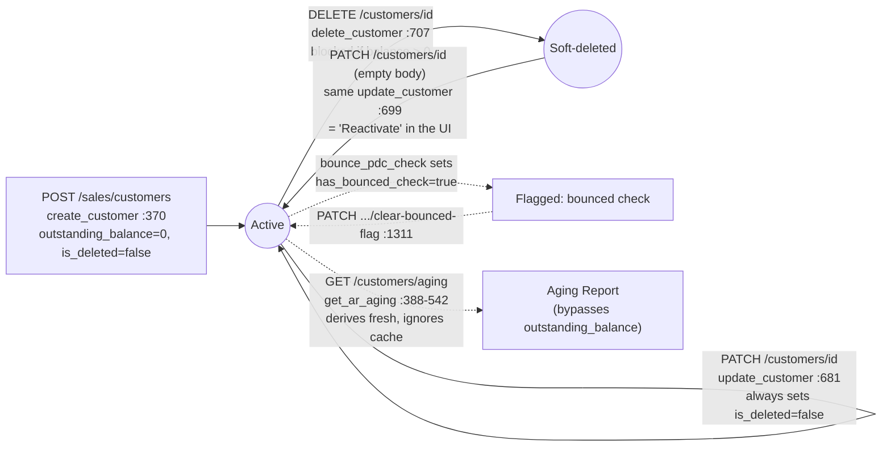
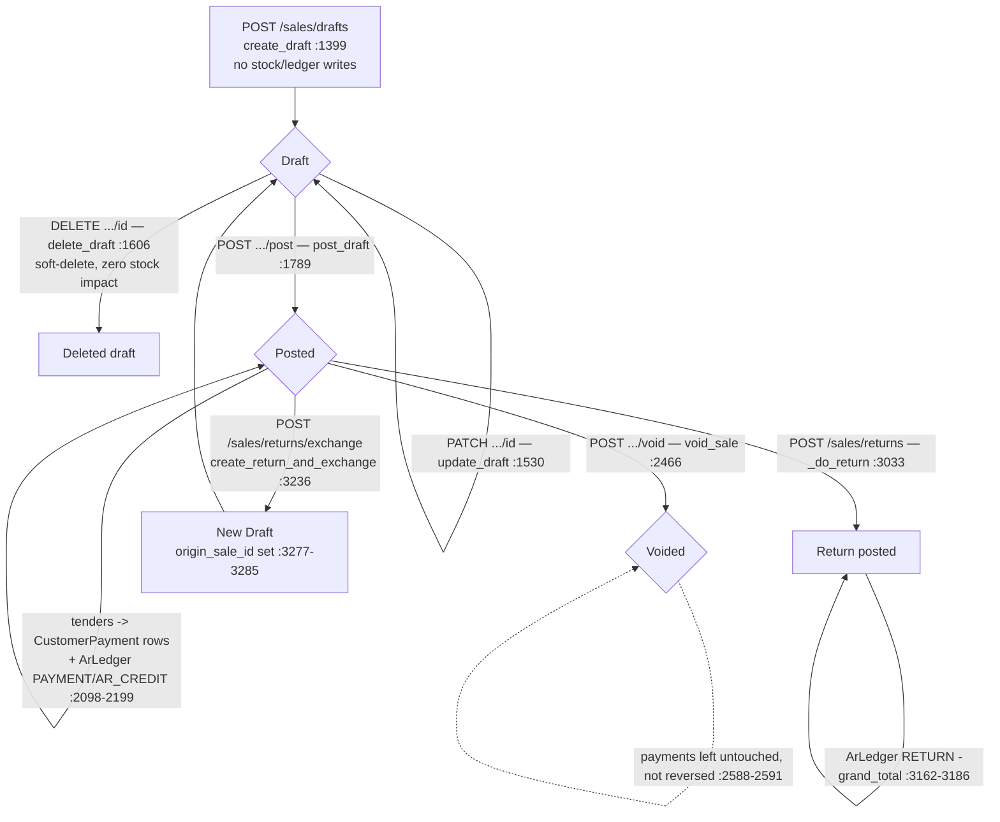
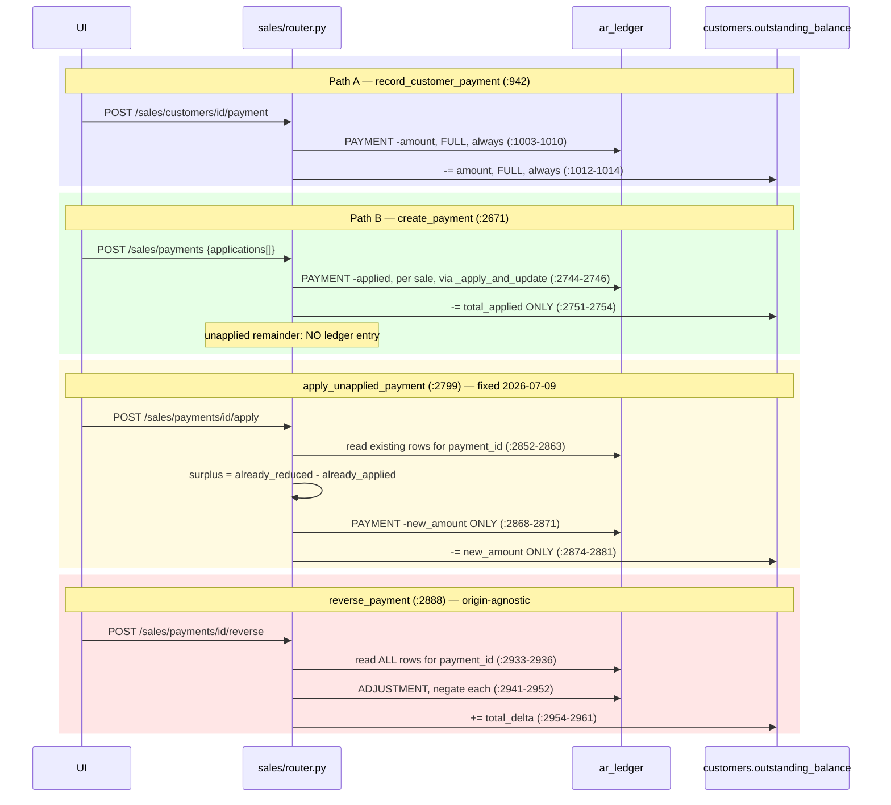
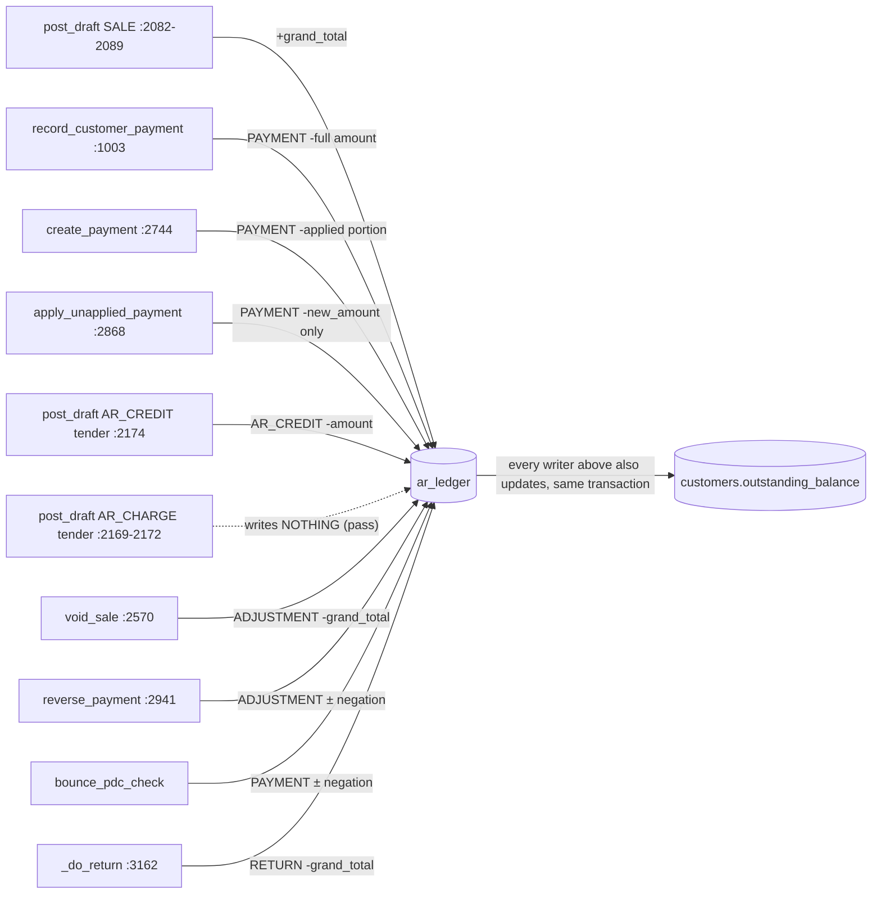

# Customers & Sales — Process Flow Reference

**Purpose**: a factual map of how records actually move through the Customers and Sales
sections of Season ERP — not an idealized version, not a bug audit. Written for someone
onboarding onto this codebase or auditing it fresh, who needs the real code paths without
re-deriving them from scratch.

**How to read this document**: every claim is backed by a `file:line` citation into
`backend/sales/router.py` (the single large router file backing both sections) unless
otherwise noted. Where this session already investigated and fixed something in depth, this
document references the relevant `docs/changelog.md` entry instead of re-deriving the fix —
look there for verification evidence. Where this document breaks new ground (customer CRUD,
draft/void/return mechanics, credit memos, reporting, audit coverage), it's based on a direct
read of the current code as of 2026-07-09.

**Scope note**: stock/inventory mechanics (FIFO consumption, cost layers, bundle explosion)
are described only to the depth needed to understand *when* stock moves during a sale's
lifecycle — full inventory-side detail belongs to a dedicated inventory-focused pass.

---

## 1. Customer Lifecycle

### 1.1 Creation

`POST /sales/customers` → `create_customer`, `backend/sales/router.py:370-385`. Requires
`manage_customers` (`router.py:374`).

Accepted fields (`schemas.CustomerCreate`, `backend/sales/schemas.py:118-121`):
`customer_name` (required), `credit_limit` (optional), `terms_days` (default `0`).

- `outstanding_balance` is hard-coded to `Decimal("0")` at creation (`router.py:380`) — it is
  not accepted from the payload at all.
- `is_deleted` is not set explicitly; relies on the model column default (`False`,
  `backend/sales/models.py:67`).
- **No validation beyond Pydantic type coercion** — no blank-name check, no
  `customer_name` uniqueness check, no `credit_limit` range check.

### 1.2 Editing & Reactivation

`PATCH /sales/customers/{id}` → `update_customer`, `router.py:681-704`. Requires
`manage_customers`.

Editable fields (`schemas.CustomerPatch`, `schemas.py:124-127`): `customer_name`,
`credit_limit`, `terms_days` — each applied only if present in the payload (partial-update
pattern, `router.py:690-695`).

The notable behavior: **every** call to this endpoint unconditionally sets
`customer.is_deleted = False` (`router.py:699`) — including a PATCH with an empty body. This
is how the frontend implements "Reactivate": it calls the same PATCH endpoint with nothing in
it. There is no separate reactivate endpoint.

### 1.3 Deactivation (soft-delete)

`DELETE /sales/customers/{id}` → `delete_customer`, `router.py:707-726`. Requires
`manage_customers`.

```python
if (customer.outstanding_balance or Decimal("0")) > Decimal("0"):
    raise HTTPException(400, "Cannot delete customer with outstanding balance ...")
customer.is_deleted = True
```
(`router.py:716-725`)

Soft-delete only — no row removal, ever. The only guard is a positive `outstanding_balance`;
a customer with a *negative* balance (i.e. holding a store-credit surplus) can be deleted
without complaint, since the check is strictly `> 0`.

### 1.4 `outstanding_balance` — the cached running total

`Customer.outstanding_balance` (`models.py:66`, `Numeric(15,2)`, default `0`) is a
denormalized cache — the single field the UI reads to answer "how much does this customer
owe / how much credit do they hold" without querying the ledger. It is updated transactionally
alongside every event that changes it — see §4 for the complete writer list and reason-code
mapping. **It is not treated as authoritative by every reader** — `get_ar_aging` (§1.5)
deliberately ignores it and recomputes from source tables instead, which is itself informative
about how much this cache is trusted in practice (see §4.3).

Every mutation to `outstanding_balance` found this session:

| Writer | Delta | Citation |
|---|---|---|
| `record_customer_payment` | `-= payload.amount` (always, full amount) | `router.py:1012-1014` |
| `create_payment` | `-= total_applied` (only the applied portion) | `router.py:2751-2754` |
| `apply_unapplied_payment` | `-= new_amount` (only the genuinely-new portion, post-fix — see §3.3) | `router.py:2874-2881` |
| `reverse_payment` | `+= total_delta` (negation of whatever the ledger actually shows) | `router.py:2954-2961` |
| `bounce_pdc_check` | `+= total_delta` (same ledger-driven technique) | see `docs/changelog.md` "2026-07-09 — Fix: bounce_pdc_check under-reversed payments with unapplied balance" |
| `post_draft` | `+= grand_total - standard_applied` | `router.py:2211-2216` |
| `void_sale` | `-= sale.grand_total` | `router.py:2578-2581` |
| `_do_return` | `-= grand_total` (for `credit_to_account`/`cash_refund` dispositions) | `router.py:3162-3186` |

`issue_credit_memo` and `cancel_credit_memo` do **not** touch it — see §3.6.

### 1.5 Customer Aging

`GET /sales/customers/aging` → `get_ar_aging`, `router.py:388-542`. Requires `manage_customers`
(not a dedicated `view_customer_aging` check — see the RBAC backlog entry, §"Known gaps").

This is the one place in the codebase that explicitly does **not** trust
`Customer.outstanding_balance`. Per its own docstring (`router.py:394-401`), it is a
"bridge-table calculation" that derives each invoice's outstanding amount fresh, every
request, from three source tables:

```
outstanding = ar_ledger SALE amount_change (router.py:418-430)
            − Σ customer_payment_applied.amount_applied WHERE mode.is_ar_charge = False (router.py:473-492)
            − Σ sales_returns.grand_total WHERE disposition = 'credit_to_account' (router.py:495-503)
```

Only invoices with `outstanding > 0` are emitted (`router.py:522-523`).

- **Invoice date** comes from `Sale.transaction_date`, not `ar_ledger.occurred_at` — chosen
  deliberately per an inline comment (`router.py:443-445`) to avoid UTC/PHT midnight drift.
- **`due_date = invoice_date + customer.terms_days`**, computed on the fly, not read from a
  stored column (`router.py:525`).
- **Buckets** (`router.py:534-538`): Current (`days_overdue ≤ 0`), 1-30, 31-60, 61-90, 91+.

Frontend (`frontend/src/pages/customers/CustomerAging.tsx`) does zero aging math client-side —
it only name-filters and sums the backend-provided bucket columns into a footer totals row,
then reformats the same rows into an XLSX export. All computation is backend-side, per-request.



---

## 2. Sale Lifecycle

### 2.1 Draft creation

`POST /sales/drafts` → `create_draft`, `router.py:1399-1500`.

Confirmed by reading the function body: **no stock deduction, no `InventoryLedger` write, no
`ArLedger` write** — it only inserts `Sale` (status `Draft`) and `SaleItem` rows. Also handles
idempotency-key lookup (returns the existing sale unchanged if a match exists,
`router.py:1416-1427`), and validates location/register/customer existence before insert.

Totals math (`_build_sale_items` and `_recalculate_totals`, `router.py:1354-1393`, shared with
posting):
- `line_total = max(0, (unit_price × (1 − discount_pct/100) − discount_flat) × quantity)`, 2dp
- `subtotal = Σ line_total`
- `discount_amount = subtotal × cart_discount_pct/100 + cart_discount_flat`
- `grand_total = max(0, subtotal − discount_amount + tax_amount)`

### 2.2 Posting a draft — the critical transaction

`POST /sales/drafts/{id}/post` → `post_draft`, `router.py:1789-2253` — the largest function in
the file. Sequence:

1. **Idempotency check** (`:1804-1817`) — returns the already-posted sale unchanged if the key matches.
2. **Credit limit check** (`:1839-1852`) — only for credit customers (`terms_days > 0` and a set `credit_limit`); rejects if `outstanding_balance + grand_total > credit_limit`.
3. **Tender/payment-mode validation** (`:1855-1898`) — including a check that total AR-Credit tendered never exceeds the customer's existing credit surplus.
4. **Per-line stock consumption** (`:1919-2036`) — Non-Inventory/Service items skip stock entirely. Bundle items explode into components, each running FIFO consumption. Regular Inventory items run `_consume_fifo_for_sale` (`:1666-1741` — oldest cost layer first, falling back to the primary supplier's list cost, then to zero-cost, tagging `cost_source` accordingly), write one `InventoryLedger` row (`reason=SALE`) and one `CurrentStock` decrement per line.
5. **Recalculate totals** from the final posted `SaleItem` rows (`:2059-2071`).
6. **`ArLedger` SALE entry** — one row, `amount_change = +grand_total` (`:2082-2089`).
7. **Tender loop** (`:2098-2199`) — for each payment tender: validates/redeems credit memos if applicable (§3.6), creates a `CustomerPayment` row (`write_audit` at `:2128-2130`), and — depending on the payment mode's flags — writes an `AR_CREDIT` ledger entry, a `PAYMENT` ledger entry, or (for `is_ar_charge` modes) nothing at all, since the SALE entry already booked the obligation (`:2169-2172`, see §4.1 for why this matters).
8. **`balance_due`/`payment_status`** computed from `grand_total − standard_applied` (`:2196-2204`); **`outstanding_balance`** updated by the same delta (`:2211-2216`).
9. **Finalize** — `sale_pid = sale_pid or f"SALE-{sale_id:05d}"` (`:2206` — this is the exact line the sale_pid fix protects; see `docs/changelog.md` "2026-07-09 — Fix: voiding a sale permanently retired its sale_pid"), `status = Posted`, `posted_at = now` (`:2205-2229`), then commit.
10. **`write_audit`** for the sale itself (`sales.sales`, UPDATE) at `:2235`, second commit at `:2238`.

### 2.3 Voiding a sale

`POST /sales/{id}/void` → `void_sale`, `router.py:2466-2609`. Only `Posted` sales are eligible
(`:2482-2489`).

1. **Stock reversal via ledger, not re-derivation** — reads every `InventoryLedger` row this
   sale originally wrote (`reference_type="sales"`, `reason=SALE`) and writes a mirrored
   `RETURN_IN` entry for the negated quantity, updating `CurrentStock` to match (`:2497-2519`).
2. **FIFO layer restoration** — restores `CostLayer.quantity_remaining` for every layer the
   sale consumed, most-recently-consumed first (`:2524-2544`).
3. **Credit memo reversal** — any `CreditMemoRedemption` tied to the sale gets its memo reset
   to `ACTIVE` and the redemption row deleted (`:2547-2561`).
4. **`ArLedger` ADJUSTMENT entry**, `amount_change = -grand_total`, and matching
   `outstanding_balance -= grand_total` (`:2570-2581`).
5. **Payments are explicitly preserved, not reversed individually** — an inline comment
   (`:2588-2591`) states `customer_payments`/`customer_payment_applied` rows are left alone as
   historical record; the single ADJUSTMENT entry is the entire reversal.
6. `status = Voided`, `voided_at`, `void_reason` set (`:2584-2586`); `write_audit` at `:2607`.

Voiding never clears `sale.sale_pid` — the fix referenced above scoped `sale_pid` uniqueness to
active (non-Voided) sales instead, so a voided sale's PID becomes reusable without needing to
be blanked on the row.

**Verified live 2026-07-10** (`docs/customers_section_verification.md` §1) — direct
verification of this section, previously only exercised indirectly via the `sale_pid` fix:

- **Single- and multi-tender voids**: both confirmed correct — stock/cost-layer reversal and
  the single `ArLedger` `ADJUSTMENT -grand_total` entry are entirely tender-count-independent;
  a two-tender sale (Cash + GCash) voided exactly the same way as a one-tender sale, one
  `ADJUSTMENT` row either way. Live-verified with real posted/voided sales, not just read from
  code.
- **`sale.balance_due`/`payment_status` are never touched by `void_sale`** — confirmed live: a
  `Partial`/`60.00`-balance-due sale stayed exactly `Partial`/`60.00` after voiding, alongside
  `status=Voided`. Not a violation of `docs/requirements.md` §13.7 (which doesn't ask for these
  fields to change), but user-visible: `SaleDetail.tsx:245-248` renders `payment_status` as its
  own colored badge unconditionally, so a voided sale that was fully paid still shows a green
  "Paid" badge next to "Voided." Frontend behavior, not incorrect backend accounting — noted so
  it isn't mistaken for a bug report if seen in the UI.
- **`write_audit` coverage — header-only**, same shape as the returns gap in
  `docs/returns_ground_truth.md` §5, not previously called out this precisely for `void_sale`
  in this document's own §5.2 table (which showed a bare ✅). Live-confirmed: after voiding a
  sale, `auth.audit_log` has exactly the `sales.sales` `UPDATE` row and nothing else — no audit
  entry for the `InventoryLedger` `RETURN_IN` reversal, the `CostLayer` restoration, the
  `CreditMemoRedemption` reversal, the `ArLedger` `ADJUSTMENT` entry, or the
  `customer.outstanding_balance` change.
- **PDC-tender interaction — a real, live-reproduced gap.** Voiding a sale that had a PDC
  tender does not touch the PDC `CustomerPayment` row at all (`check_status` stays `IN_VAULT`,
  still linked via `CustomerPaymentApplied` to the now-`Voided` sale). Neither
  `deposit_pdc_check` nor `bounce_pdc_check` checks the linked sale's status before acting —
  live-confirmed both still succeed (`200`) against a payment whose sale is already `Voided`.
  Depositing afterward is semantically confusing but not financially harmful (deposit touches
  only `check_status`/`payment_date`). Bouncing afterward **is** harmful — see the general
  `balance_due` corruption bug below (§3.4/§3.5), which this void interaction triggers but does
  not itself cause; the same corruption reproduces on a perfectly normal, never-voided sale.

### 2.4 Returns and exchanges

Shared helper `_do_return` (`router.py:3033-3232`, does not commit) backs both endpoints:

- **Linked vs. blind**: `is_blind = payload.sale_id is None`. Blind returns (no original sale)
  require the `process_blind_returns` action (`:3046-3047`, already covered by this session's
  RBAC audit).
- **Linkage** — each `SalesReturnItem` carries the original `sale_item_id` and its
  `cost_layer_id`, so the credited price is the *actual paid* per-unit price
  (`si.line_total / si.quantity`), not re-entered (`:3079-3105`).
- **Stock** — `InventoryLedger` `RETURN_IN` entry, positive `CurrentStock` delta, and
  `CostLayer.quantity_remaining` restoration where the layer is known (`:3128-3160`).
- **AR** — for `credit_to_account`/`cash_refund` dispositions with a customer: `ArLedger`
  `RETURN` entry, `amount_change = -grand_total`, and matching `outstanding_balance` decrement
  (`:3162-3186`).
- **Cash refund** — creates a *negative* `CustomerPayment`/`CustomerPaymentApplied` pair against
  the original sale's largest non-AR tender (`:3188-3221`).

`create_return` (`:3308-3329`) simply calls `_do_return` then commits and audits
(`sales.sales_returns`, INSERT, `:3324`).

`create_return_and_exchange` (`:3236-3306`) calls `_do_return`, then creates a **new `Draft`
sale** with `origin_sale_id = payload.sale_id` (`:3277-3285` — this is how an exchange links
back to the original transaction), inheriting location/customer from the original. The new
draft is created empty — despite the function's own docstring implying a pre-populated
Store-Credit tender, the actual code sets no `idempotency_key` and adds no items/tenders; it
must be built out through the normal draft-editing flow afterward.

### 2.5 Stock/inventory touchpoints — summary

| Stage | Stock/ledger impact |
|---|---|
| Draft create/update/delete | **None** — confirmed by absence of any ledger/stock code in `create_draft`/`update_draft`/`delete_draft` |
| Post | FIFO consumption, `InventoryLedger` `SALE`, `CurrentStock` decrement (`:1966-2036`) |
| Void | `InventoryLedger` `RETURN_IN` mirror, `CostLayer` restoration (`:2497-2544`) |
| Return | `InventoryLedger` `RETURN_IN`, `CostLayer` restoration (`:3142-3160`) |

Full FIFO/cost-layer mechanics are out of scope for this document — see an inventory-focused
pass for that detail.



---

## 3. Payment Lifecycle

### 3.1 Two creation paths — and why they differ

This session's central finding: **`record_customer_payment` and `create_payment` book AR
impact at fundamentally different times**, and every downstream fix this session
(`apply_unapplied_payment`, `reverse_payment`, `bounce_pdc_check`) exists because of that
divergence.

- **`record_customer_payment`** (`POST /sales/customers/{id}/payment`, `router.py:942-1020`):
  writes **one `ArLedger` `PAYMENT` entry for the full `payload.amount`, always**
  (`:1003-1010`), and reduces `outstanding_balance` by the full amount (`:1012-1014`) —
  regardless of whether any of it is applied to a specific sale. If `payload.sale_id` is given,
  it also creates one `CustomerPaymentApplied` row for the full amount (`:989-993`) and sets
  `unapplied_amount = 0`; otherwise the whole amount sits as `unapplied_amount` with its AR
  impact **already fully booked**.
- **`create_payment`** (`POST /sales/payments`, `router.py:2671-2762`): accepts a list of
  `applications`, and via the shared `_apply_and_update` helper (`:2632-2667`) writes an
  `ArLedger` `PAYMENT` entry **only for each applied portion** (`:2744-2746`). Any remainder
  becomes `unapplied_amount` with **zero AR impact booked yet** — nothing is written for it.

Same shape of data (`unapplied_amount > 0`), opposite AR-ledger state underneath. Any code that
later touches "the unapplied remainder" of a payment cannot assume which case it's in — it has
to check the ledger. That's the origin-agnostic principle this session established and applied
to all three fixes below.

### 3.2 A third and fourth de-facto creation path

*Corrected 2026-07-10, after a ground-truth verification pass: this section originally
documented only one additional path (the `post_draft` tender loop) and framed §3.1 + this
section as the complete picture ("all three fixes" at the end of §3.1 refers to that
three-path count). A direct grep of every `models.CustomerPayment(` instantiation in the
backend found a fourth site, described below. See `docs/backlog.md`, "The four-creation-paths
finding" and "Payment creation has no duplicate-submission protection" entries for the
verification pass this correction came from.*

**Third — tenders inside `post_draft`.** Every payment tendered at sale-posting time also
creates a `CustomerPayment` row
(`router.py:2135`, `write_audit` at `:2143-2145`) — see §2.2 step 7. Its AR ledger behavior
follows the same mode-flag branching as the standalone paths (`AR_CHARGE` → nothing,
`AR_CREDIT` → its own reason, standard/credit-memo → `PAYMENT`), so it doesn't introduce a
third distinct booking pattern, but it is a third code path capable of inserting
`customer_payments` rows — relevant to the audit-coverage map in §5.

**Fourth — the cash-refund negative payment inside `_do_return`.** Already described in §2.4's
return-processing walkthrough (`router.py:3188-3221`) but not previously counted as a payment
*creation* path in this section. Gated by `disposition == 'cash_refund' and sale_id is not
None` (`:3196`): finds the largest non-AR-charge, non-AR-credit tender originally applied to
the sale, and creates a **negative** `CustomerPayment` (`amount = -grand_total`, `:3212-3223`)
plus a matching negative `CustomerPaymentApplied` row (`:3226-3230`) against the same sale. It
has no dedicated `write_audit` call — the `write_audit` calls in `create_return`/
`create_return_and_exchange` (§5.1) are both for `sales.sales_returns`, not this payment row.
Unlike the other three paths, this one is never presented to the user as "creating a payment" —
it's a side effect of choosing the (default) cash-refund disposition on a linked return in
`ReturnNew.tsx`, not a dedicated payment-entry screen.

### 3.3 Application — `apply_unapplied_payment`

`POST /sales/payments/{id}/apply`, `router.py:2799-2884`. Fixed this session — see
`docs/changelog.md` "2026-07-09 — Fix: apply_unapplied_payment double-counted AR impact" for
full derivation and live verification evidence. Summary of the fix as it stands in code today:

Before writing anything, it sums the payment's actual `ArLedger` reductions
(`already_reduced`, `:2852-2858`) and its actual `CustomerPaymentApplied` total
(`already_applied`, `:2859-2863`), derives `surplus = max(0, -already_reduced - already_applied)`
(`:2864`) — the amount already counted against this payment but not yet formally applied — and
only writes a new ledger entry / reduces `outstanding_balance` for the genuinely-new remainder
(`:2865-2881`). The `CustomerPaymentApplied` row and the sale's `balance_due`/`payment_status`
update happen unconditionally either way, via `_apply_and_update`'s `ledger_amount` parameter.

**No `write_audit` call in this endpoint** — see §5.

### 3.4 Reversal — `reverse_payment`

`POST /sales/payments/{id}/reverse`, `router.py:2888-2990`. Implemented this session — see
`docs/changelog.md` "2026-07-09 — Feature: standalone customer payment reversal (correction
mechanism)" and `docs/payment_correction_proposal.md` for full design rationale and live
verification.

Origin-agnostic by the same principle: reads every `ArLedger` row actually tagged to this
`payment_id` (`:2933-2936`) and writes a negating `ADJUSTMENT` entry for each
(`reason="ADJUSTMENT"`, `:2941-2952`) rather than re-deriving what *should* have happened from
business rules. Restores `balance_due`/`payment_status` on every linked sale
(`:2965-2979`, applications preserved as history, not deleted). Full reversal only — no
partial-amount correction (`:2896-2898`). Excludes: already-reversed payments (`:2913-2914`),
bounced PDC checks (already reversed via §3.5, `:2915-2919`), and credit-memo-mode payments
(`:2920-2928` — a memo redemption is tied to the *sale*, not the payment, and reversing here
would leave it permanently `REDEEMED`). `write_audit` at `:2985-2988`.

**NEW GAP, found and live-verified 2026-07-10** (`docs/customers_section_verification.md` §3):
the `is_ar_charge` exclusion list above is correct as far as it goes, but there's a fourth mode
class it does *not* exclude and should: **`is_ar_charge` payments (Charge, PDC) corrupt
`sale.balance_due` when reversed.** The restore step (`sale.balance_due = (sale.balance_due or
0) + apply.amount_applied`, `:3017-3018`) assumes `apply.amount_applied` was previously
*subtracted* from `balance_due` at post time — true for standard tenders (they count toward
`standard_applied`), **false for `is_ar_charge`/`is_ar_credit` tenders**, which are deliberately
excluded from `standard_applied` so `balance_due` reflects only cash/card actually collected
(§2.2 step 8). For an `is_ar_charge` tender, `balance_due` was never reduced by it in the first
place — so adding `apply.amount_applied` back on reversal double-counts it. Live-reproduced on
a perfectly ordinary, never-voided, still-`Posted` sale: a $100 sale fully tendered via
Charge posts with `balance_due=100` (correct, matches §2.2 step 11's `standard_applied=0`
case); reversing that one Charge payment via this endpoint leaves the sale at
**`balance_due=200`** — double `grand_total`, on an active sale. `customer.outstanding_balance`
itself is *not* corrupted in this case (Charge writes no `ArLedger` row at creation, so there's
nothing for the ledger-reading step to reverse, and it correctly no-ops) — the corruption is
confined to the `Sale` row's own cached `balance_due`/`payment_status`, which
`SaleDetail.tsx`/`SalesLedger.tsx` display directly. Reader endpoints that recompute from
source tables instead of trusting the cache (`get_ar_aging`, `_build_customer_transaction_ledger`)
are unaffected — live-checked, both continued showing the correct `100.00` for the affected
sale. The identical bug reproduces via `bounce_pdc_check` (§3.5) for the same reason, since PDC
is also `is_ar_charge`. Not previously documented; filed to `docs/backlog.md`.

### 3.5 PDC deposit and bounce

- **`deposit_pdc_check`** (`PATCH /sales/pdc/{id}/deposit`, `router.py:1180-1219`): marks
  `check_status = DEPOSITED`, updates `payment_date` to the actual deposit date. Requires
  `check_status == IN_VAULT` beforehand (`:1200`). `write_audit` at `:1214`.
- **`bounce_pdc_check`** (`PATCH /sales/pdc/{id}/bounce`, `router.py:1223-1322`): fixed earlier
  this session — see `docs/changelog.md` "2026-07-09 — Fix: bounce_pdc_check under-reversed payments
  with unapplied balance." Same ledger-reading technique as `reverse_payment`: sums the
  payment's actual `ArLedger` rows and reverses them (keeping `reason="PAYMENT"` on the reversal
  entries, deliberately not `ADJUSTMENT`, to preserve pre-existing bounce semantics for the case
  that already worked correctly), restores sale balances, sets `check_status = BOUNCED` and
  `customer.has_bounced_check = True`. `write_audit` at `:1317`. Also requires
  `check_status == IN_VAULT` beforehand (`:1243`).

**Verified live 2026-07-10** (`docs/customers_section_verification.md` §4):

- **`deposit_pdc_check` — confirmed correct, no ledger/balance interaction of any kind.** Since
  a PDC tender's full AR obligation is already booked by the `SALE` ledger entry at post time
  (PDC is `is_ar_charge`, writes nothing of its own — §4.1), and `balance_due` is deliberately
  never reduced by it either, there is genuinely nothing for deposit to under- or over-count:
  it touches only `check_status`/`payment_date`. Live-confirmed: depositing a PDC check changes
  neither `customer.outstanding_balance` nor the linked sale's `balance_due`. `write_audit`
  coverage confirmed present (`auth.audit_log` shows the `UPDATE` row).
- **NEW GAP — there is no path from `DEPOSITED` to `BOUNCED`.** Both `deposit_pdc_check` and
  `bounce_pdc_check` require `check_status == 'IN_VAULT'`; once a check is marked `DEPOSITED`,
  it can never be marked `BOUNCED` through any endpoint in this backend (confirmed by grepping
  every `check_status =` write site — exactly two, both gated on `IN_VAULT`). Live-reproduced:
  deposited a PDC check, then attempted to bounce it — rejected with `400 Cannot bounce check
  with status 'DEPOSITED'`. This is a real workflow gap, not an edge case: a post-dated check
  realistically bounces *after* being deposited (that's the point of depositing it — submitting
  it to the bank, which is what can then reject it), not while still sitting in the vault. The
  only bounce path this system supports (`IN_VAULT → BOUNCED`) models the less common case of a
  check being pulled before ever attempting deposit. As a direct consequence, the "deposit then
  later bounce" sequence asked about is not just unverified — it's currently impossible to
  perform through this system at all. Not previously documented; filed to `docs/backlog.md`.
- **Interaction with the already-fixed bounce logic — still correct on the ledger side.**
  Re-verified the 2026-07-09 fix isn't regressed: bouncing a PDC payment with zero prior
  `ArLedger` rows (the normal case, since PDC writes none at creation) correctly computes
  `total_delta=0` and leaves `outstanding_balance` unchanged — no regression. The *new* gap
  found this pass (§3.4's `balance_due` corruption) is a separate bug in the same function,
  affecting the `sale.balance_due` restore step, not the ledger-reading fix from 2026-07-09.

### 3.5a Charge payments (`payment_mode_id=7`, `is_ar_charge`) — traced end-to-end 2026-07-10

Not previously traced this session beyond the one-line mention in
`docs/payment_ground_truth.md` §1 ("Central to the Customer Transaction Ledger feature"). Full
walkthrough, with live verification, in `docs/customers_section_verification.md` §3; summary:

- **Creation path: exclusively path 3 (`post_draft`'s tender loop), via the POS Workstation.**
  Charge shares PDC's `is_ar_charge` branch (§4.1) — requires a registered customer
  (backend-enforced, `router.py:1890-1894`, not just the `Workstation.tsx` pre-flight check).
  Technically reachable via `record_customer_payment`/`create_payment` at the API layer too (no
  backend restriction blocks it there), but both of those endpoints' frontend screens
  (`CustomerDetail.tsx:62`, `CustomerARLedger.tsx:173`) explicitly filter `is_ar_charge`/
  `is_ar_credit` modes out of their dropdowns, so it's a real capability of the API but not a
  reachable UI path outside the POS.
- **Transaction Ledger relationship**: `_build_customer_transaction_ledger` (`:778-896`, backing
  §6's Customer Transaction Ledger) scopes itself to exactly the sales that had an `is_ar_charge`
  tender applied — a Charge tender is what makes a sale appear in this ledger at all. Debit rows
  = the `is_ar_charge`-applied amount per sale; credit rows = later collections applied against
  those same sales via any non-`is_ar_charge` mode.
- **Accounting — confirmed correct** for the core single/split-tender cases: a Charge tender
  writes nothing to `ar_ledger` itself (the `SALE` entry already books the full obligation) and
  is excluded from `standard_applied`, so `balance_due` stays at the un-charged portion (or the
  full `grand_total` if wholly charged) — live-verified with a $100 sale fully tendered via
  Charge: `balance_due=100`, `payment_status=Unpaid`, matching the documented design (§2.2 step
  11 — an AR-charged sale must not read as `Paid`).
- **`reverse_payment` interaction — not blocked by the credit-memo restriction (correctly so),
  but hits the `balance_due`-corruption bug described in §3.4.** Charge isn't excluded by any of
  `reverse_payment`'s three guards (already-reversed, bounced-PDC, credit-memo-mode) — correct,
  since none of those apply to Charge — but reversing a Charge payment doubles the linked sale's
  `balance_due` for the same reason a PDC bounce does (§3.4). Live-reproduced.
- **`write_audit` coverage — confirmed present.** Charge payments go through the same per-tender
  `write_audit` call in `post_draft`'s loop as every other tender (`:2151`, INSERT) — no
  Charge-specific gap.

### 3.6 Credit memo issue / redemption / cancellation

Not previously investigated this session — full walkthrough below.

**Model** (`backend/sales/models.py:394-441`): `CreditMemo` (`code` unique, `amount`, `status`
default `ACTIVE`, `issued_at`, `valid_until`, optional `return_id` link, `issued_by_user_id`,
`cancelled_by_user_id`/`cancelled_at`); `CreditMemoRedemption` (`memo_id`, `sale_id`,
`amount_redeemed`, `redeemed_at`, `redeemed_by_user_id`).

**Issuing** — `POST /sales/credit-memos` → `issue_credit_memo`, `router.py:3745-3792`. Requires
`issue_credit_memo` permission. `valid_until` defaults to `issued_at + 30 days` (`:3755`). Code
is generated by `_generate_memo_code` (`:64-71` — `CM-` + 6 random uppercase/digit chars,
retries up to 5 times on collision). **Writes no `ArLedger` entry and touches no
`outstanding_balance`** — confirmed by full read of the function body; issuance is purely a row
insert. **No `write_audit` call.**

**Validating** — `GET /sales/credit-memos/validate?code=...` → `validate_credit_memo`,
`router.py:3639-3675`. Checks `NOT_FOUND` / `REDEEMED` / `CANCELLED` / `EXPIRED`. This is a
read-only pre-check endpoint, but **it is not actually called from inside `post_draft`** —
redemption re-implements the same checks inline instead (below).

**Redemption** — happens inside `post_draft`'s tender loop (`router.py:2086-2148`), when a
tender's payment mode has `is_credit_memo = true`:
1. Memo fetched with a row lock (`with_for_update`, `:2093-2098`); inline validation mirrors
   `validate_credit_memo`'s checks (`:2101-2108`).
2. `amount_to_apply = min(tender.amount, remaining_balance)` — capped by the *sale's* remaining
   balance, **not** by the memo's own `amount` (`:2110`, confirmed no such comparison exists).
3. `memo.status = "REDEEMED"` is set **unconditionally** the moment any amount applies
   (`:2141-2142`), and a `CreditMemoRedemption` row records the actual amount consumed
   (`:2143-2148`).
4. `credit_memos.amount` is **never decremented** — the face value stays as issued forever; only
   `status` flips. There is no "remaining balance" field. **Redemption is effectively
   all-or-nothing from the memo's own lifecycle perspective**: a memo can be used for less than
   its full `amount` (if the sale's remaining balance is smaller), but whatever is left over is
   not preserved as spendable credit anywhere — the memo is simply marked `REDEEMED`.
5. The redeemed amount is **not AR-silent** — because `is_credit_memo` is a separate flag from
   `is_ar_charge`/`is_ar_credit`, it falls into the generic tender branch, writing an `ArLedger`
   `PAYMENT` entry (`amount_change = -amount_to_apply`) and reducing `outstanding_balance`
   exactly like a cash/card tender would (`:2169-2202`).

**Cancelling** — `POST /sales/credit-memos/{id}/cancel` → `cancel_credit_memo`,
`router.py:3835-3879`. Requires `cancel_credit_memo`. Only `ACTIVE` memos are cancellable
(`:3849-3853` — since redemption always flips status away from `ACTIVE`, this implicitly
guarantees no redemptions exist on a memo being cancelled). Sets `status = "CANCELLED"`,
`cancelled_by_user_id`, `cancelled_at`. **No `ArLedger` write, no `outstanding_balance` touch,
no `write_audit` call.**

**Net picture**: a credit memo lives entirely *outside* the AR ledger while un-redeemed
(issuance and cancellation are both AR-silent) but is treated exactly like a cash tender for AR
purposes the moment it's redeemed against a sale.



---

## 4. The AR Ledger — the central mechanism

`sales.ar_ledger` (`ArLedger` model) is the immutable event log every above flow ultimately
feeds. `reason` is a free-form column; per `docs/schema.dbml` the intended values are `SALE,
PAYMENT, RETURN, ADJUSTMENT, AR_CHARGE, AR_CREDIT`.

### 4.1 Reason codes and their actual writers

| Reason | Written by | Amount | Notes |
|---|---|---|---|
| `SALE` | `post_draft` | `+grand_total` | One entry per posted sale (`:2082-2089`) |
| `PAYMENT` | `record_customer_payment` | `-full amount` | Always, regardless of application (`:1003-1010`) |
| `PAYMENT` | `create_payment` (via `_apply_and_update`) | `-applied portion` | Per sale application (`:2744-2746`) |
| `PAYMENT` | `apply_unapplied_payment` | `-new_amount only` | Skips already-counted surplus, post-fix (`:2868-2871`) |
| `PAYMENT` | `post_draft` tender loop (standard/credit-memo tenders) | `-amount_to_apply` | `:2169-2189` |
| `PAYMENT` | `bounce_pdc_check` reversal | `±negation` | Deliberately kept as `PAYMENT`, not `ADJUSTMENT`, per fix design |
| `AR_CREDIT` | `post_draft` tender loop (`is_ar_credit` mode) | `-amount_to_apply` | `:2174-2181` |
| `AR_CHARGE` | **nobody** | — | `is_ar_charge` tenders explicitly write nothing (`:2169-2172`, `pass`) — the obligation is already booked by the `SALE` entry. **This reason code is defined in the schema but has zero writers in the current codebase.** |
| `ADJUSTMENT` | `void_sale` | `-grand_total` | `:2570-2577` |
| `ADJUSTMENT` | `reverse_payment` | `±negation of actual rows` | `:2941-2952` |
| `RETURN` | `_do_return` | `-grand_total` | `credit_to_account`/`cash_refund` dispositions only (`:3162-3186`) |

### 4.2 How `outstanding_balance` stays consistent with the ledger

Every writer above pairs its `ArLedger` insert with an `outstanding_balance` update in the
*same* function, same transaction — see the table in §1.4 for the exact deltas. There is no
separate reconciliation job (see §"Known gaps" — no scheduled jobs exist at all in this
backend) — consistency is maintained purely by discipline: every code path that writes a ledger
row also updates the cache inline, by construction, not by a later batch process.

### 4.3 Why "read the ledger, don't assume" became this session's core fix pattern

Every one of §3's fixes (`apply_unapplied_payment`, `reverse_payment`, `bounce_pdc_check`) was
broken, in one way or another, by code that assumed a payment's AR impact could be inferred
from *which endpoint created it* or from `CustomerPaymentApplied` totals alone. Because
`record_customer_payment` and `create_payment` book AR impact at different times (§3.1), any
such assumption is wrong for one of the two origins. The fix in all three cases was the same:
stop asking "which code path made this payment, and what does that imply?" and instead ask
"what does `ar_ledger` actually say happened to this `reference_id` so far?" — then act on that.
`get_ar_aging` (§1.5) independently arrives at the same philosophy from the read side: it
doesn't trust the `outstanding_balance` cache either, and derives fresh from `ar_ledger` +
`customer_payment_applied` + `sales_returns` every time. The ledger, not any cached field or
any single code path's business logic, is the one thing every part of this system that cares
about correctness ultimately defers to.



---

## 5. Audit Trail Coverage

`write_audit(db, table_name, record_pk, action, actor_user_id, old_values, new_values)`
(`backend/core/audit.py:26-47`) appends an `AuditLog` row.

### 5.1 All `write_audit` call sites in `backend/sales/router.py`

| Line | Table | Action | Function |
|---|---|---|---|
| 1016 | `sales.customer_payments` | INSERT | `record_customer_payment` |
| 1191 | `sales.customer_payments` | UPDATE | `deposit_pdc_check` |
| 1294 | `sales.customer_payments` | UPDATE | `bounce_pdc_check` |
| 1312 | `sales.customers` | UPDATE | `clear_bounced_flag` |
| 2128 | `sales.customer_payments` | INSERT | `post_draft` (tender-created payment) |
| 2235 | `sales.sales` | UPDATE | `post_draft` (the sale itself) |
| 2607 | `sales.sales` | UPDATE | `void_sale` |
| 2758 | `sales.customer_payments` | INSERT | `create_payment` |
| 2985 | `sales.customer_payments` | UPDATE | `reverse_payment` |
| 3295 | `sales.sales_returns` | INSERT | `create_return_and_exchange` |
| 3324 | `sales.sales_returns` | INSERT | `create_return` |

### 5.2 Coverage map — every mutating endpoint in these two sections

| Endpoint | Covered? |
|---|---|
| `create_customer` | ❌ |
| `update_customer` | ❌ |
| `delete_customer` | ❌ |
| `record_customer_payment` | ✅ (1016) |
| `create_payment` | ✅ (2758) |
| `apply_unapplied_payment` | ❌ |
| `reverse_payment` | ✅ (2985) |
| `deposit_pdc_check` | ✅ (1191) |
| `bounce_pdc_check` | ✅ (1294) |
| `clear_bounced_flag` | ✅ (1312) |
| `create_draft` / `update_draft` / `delete_draft` | ❌ |
| `post_draft` | ✅ (2128, 2235) |
| `void_sale` | ✅ (2607) |
| `create_return` | ✅ (3324) |
| `create_return_and_exchange` | ✅ (3295) |
| `issue_credit_memo` | ❌ |
| `cancel_credit_memo` | ❌ |
| `create_shift` / `update_shift` | ❌ |
| `create_payment_mode` / `update_payment_mode` | ❌ |
| `create_register` / `update_register` | ❌ |

**Reading this table**: every financially-consequential *correction* mechanism added this
session (`reverse_payment`, `bounce_pdc_check`) is covered — that was deliberate, per the
"Payment audit gap fix" work (`docs/changelog.md` "2026-07-08 — Fix: payment audit gap"). The
entire customer entity CRUD surface, all of draft lifecycle, credit memo issuance/cancellation,
and `apply_unapplied_payment` (a real financial mutation) have no audit trail at all today.
Note also that `create_return`/`create_return_and_exchange`'s ✅ above covers the
`sales.sales_returns` row only (§3.2's fourth path detail) — the negative `CustomerPayment` row
`_do_return` creates for a cash refund is a separate financial mutation with no `write_audit`
call of its own, even on a return whose own audit row is present.

**Correction, 2026-07-10** (`docs/customers_section_verification.md` §1): `void_sale`'s ✅ above
has the exact same caveat as the returns row just described, live-confirmed this pass — it
covers the `sales.sales` header row only. The `InventoryLedger` `RETURN_IN` reversal, the
`CostLayer` restoration, the `CreditMemoRedemption` reversal, the `ArLedger` `ADJUSTMENT` entry,
and the `customer.outstanding_balance` update triggered by every void have no audit trail of
their own — confirmed by a direct `audit_log` query after a live void showing exactly one row
(`sales.sales`, `UPDATE`) for the whole transaction.

---

## 6. Reporting & Exports

No server-generated Excel files exist anywhere in `backend/sales/router.py` (grepped for
`xlsxwriter`/`openpyxl`/`StreamingResponse`/`.xlsx` — zero matches). Every export in this
section is built **client-side** using `frontend/src/lib/xlsxMoney.ts`
(`jsonToFormattedSheet`/`MONEY_FORMAT`) against JSON the backend already returns. **No
scheduled/background jobs exist anywhere in this backend** — grepped for
`APScheduler|BackgroundScheduler|cron|scheduler|celery|@repeat_every`, zero matches. Every
number below is computed on-demand, per request.

| Surface | Endpoint | Reads | Computed vs. cached |
|---|---|---|---|
| Sales Ledger dashboard | `GET /sales/summary` (`:3441-3615`) | `Sale`, `SaleItem`, `SalesReturn`, raw-SQL join through `customer_payment_applied → customer_payments → payment_modes` | `merchandise_gross`/`cart_discounts`/`variances` read cached `Sale` columns; `gross_profit` computed from `SaleItem.net_unit_cost` (cached at posting, `cost_source ∈ {fifo, supplier_list}` only); collections-by-mode computed live from application rows. No `ar_ledger` or `cost_layers` reads. |
| Sales Ledger table + totals | `GET /sales/` (`:2275-2444`) | `Sale` (+ `sales_returns` when included) | Row `non_merchandise_revenue` computed per row; the totals row sums cached `Sale` columns across the **full filtered set**, not just the returned page (`combined`, not `page[:limit]`) |
| Customer Aging | `GET /sales/customers/aging` | see §1.5 | Fully computed, ignores `outstanding_balance` cache entirely |
| Customer Transaction Ledger | `GET .../transaction-ledger` + `/export` (`_build_customer_transaction_ledger`, `:778-898`) | `CustomerPaymentApplied` joined to `Sale`/`PaymentMode` | Debit/credit rows and `running_balance` fully computed from application rows, iterated chronologically from zero — does **not** read `Sale.grand_total`, `Sale.balance_due`, `Sale.payment_status`, `Customer.outstanding_balance`, or `ar_ledger` at all. `/export` calls the identical unpaginated builder — no separate computation path. |
| Raw AR Ledger view | `GET /sales/ar-ledger` (`:1023-1049`) | `ar_ledger` directly | Verbatim paginated read, no aggregation |
| All XLSX buttons | frontend-side, `xlsxMoney.ts` | whatever JSON the page already fetched | Presentation formatting only (number-format stamping), no recomputation |

---

## Known gaps

These are open items that touch the flows documented above. Full detail lives where cited —
not re-explained here.

- **RBAC — 32 of 57 actions have no backend enforcement** (corrected 2026-07-09 from an earlier
  miscount of 54/29 — see `docs/backlog.md`), including several inside these two
  sections (e.g. `view_customer_aging`, `view_credit_memos`, `manage_pdc` are all phantom keys
  checked under a different action or not at all; variant-adjacent gaps are also listed there).
  Tracked in `docs/backlog.md`, section "RBAC / Access Control — audit findings, not yet
  remediated (2026-07-09)"; full action-by-action detail in the linked artifact from that
  session.
- **Variant deactivation UI wiring** — not yet implemented (backend soft-delete endpoint exists
  and works; frontend never calls it). Mentioned only as a supporting example inside the RBAC
  backlog entry above — not yet logged as its own standalone backlog item.
- **`create_payment` split-commit** — `router.py:2756-2761` commits the payment (and its full
  financial effect: ledger, `outstanding_balance`) in one transaction, *then* calls
  `write_audit` and commits again in a second transaction — unlike every other mutation in this
  file, which folds `write_audit` into the same single commit as the financial write (a pattern
  this session's fixes were explicit about maintaining, e.g. `docs/changelog.md:215`). A crash
  between the two commits leaves a real, financially-effective payment with no audit trail.
  Tracked in `docs/backlog.md`, section "create_payment split-commit — audit gap, not yet
  remediated (2026-07-09)".
- **`balance_due` corruption on reversing/bouncing an `is_ar_charge` payment** — found and
  live-verified 2026-07-10, see §3.4/§3.5 above and `docs/customers_section_verification.md` §3.
  `reverse_payment` and `bounce_pdc_check` both restore a linked sale's `balance_due` by
  unconditionally adding back the applied amount — correct for standard tenders (which reduce
  `balance_due` at post time), wrong for `is_ar_charge`/PDC tenders (never reduce it), producing
  `balance_due` values that exceed `grand_total` on the `Sale` row. Confined to that cached
  column — `get_ar_aging` and `_build_customer_transaction_ledger` derive independently and are
  unaffected. Not yet remediated.
- **No `DEPOSITED → BOUNCED` transition for PDC checks** — found and live-verified 2026-07-10,
  see §3.5 above. Both `deposit_pdc_check` and `bounce_pdc_check` require `check_status ==
  'IN_VAULT'`; a deposited check can never be marked bounced through this system, even though
  that's the realistic real-world sequence for a post-dated check. Not yet remediated.
- **`void_sale` never resets `sale.balance_due`/`payment_status`** — see §2.3 above. Not a
  violation of `docs/requirements.md` §13.7, but `SaleDetail.tsx` displays `payment_status` as
  an unconditional badge, so a voided sale that was fully paid still shows "Paid" next to
  "Voided." Noted as a UI-observable consequence, not filed as a backend defect.
- **Pagination — `list_sales` cursor is non-functional** — `GET /sales/` (`router.py:2275-2444`)
  declares and documents a `cursor`-based Load More contract that the implementation never
  honors: `cursor` is parsed but never applied to the query, `q.all()` fetches every matching
  row unbounded, the "page" is a Python-side `combined[:limit]` slice, and `next_cursor` is
  hardcoded to `None` regardless of how much data exists beyond it. Since the `totals` row is
  computed from the full filtered set *before* that slice, any filter matching more than
  `limit` (default 100) sales shows a totals bar that doesn't match the visible rows, with no
  way to reach the rest. `list_payments` (`router.py:2765-2785`) has the smaller, related issue
  of no pagination parameters at all. Both tracked in `docs/backlog.md`, section "Sales Ledger
  (`GET /sales/`) cursor pagination is non-functional — not yet remediated (2026-07-09)".
